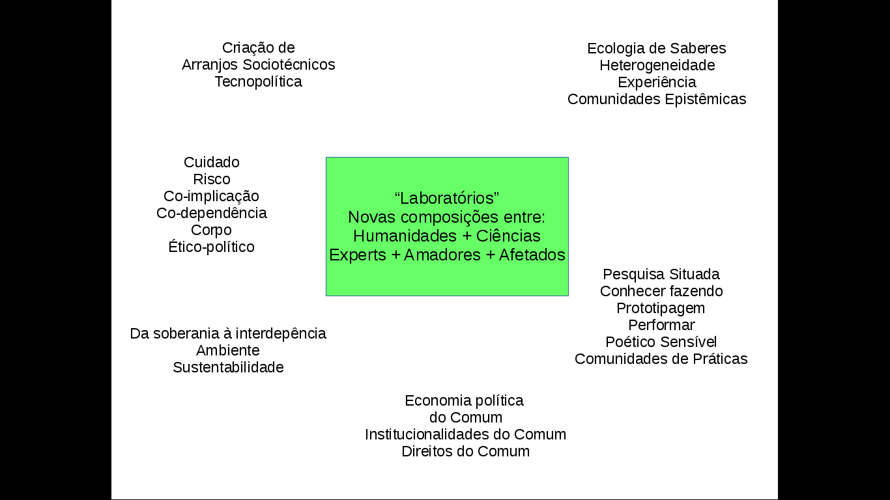

Seriam os laboratórios experimentais, situados na cidade, veículos potentes para promover a construção do comum? Vamos ver algumas experiências que vêm tentando avançar neste sentido.

===

O professor Henrique Parra, da Unifesp de Guarulhos, tem pesquisado a possível relação entre laboratórios e transformação positiva da sociedade. Para ele, a abertura é um dos elementos centrais:

> "A produção de conhecimentos no contexto dos laboratório é aberta, situada e colaborativa. Abertura no sentido de que todos devem ser capazes de aportar uma nova perspectiva, há contraste de argumentos e a possibilidade de não bloquear uma controvérsia; isso também significa que o conhecimento aberto é sempre provisório. Ele não visa encerrar um debate ou um problema, mas ao contrário, torná-lo mais denso, mais rico e complexo."

Ele acrescenta mais alguns fatores centrais na construção de laboratórios para o comum:

> "É **colaborativo** porque é feito **entre todos**, com o maior número de perspectivas e atores possíveis. É **situado** porque é produzido em contextos específicos e reconhece o caráter parcial, corporificado e perspectivo dos conhecimentos. Mas para que isso ocorra certas condições devem ser respeitadas para que diferentes atores possam participar. Essas condições implicam em: **infraestruturas** mais abertas e horizontais; **documentação** rigorosa, acessível e reproduzível; **protocolos** (para tecnologias e regime de propriedade) que garantam abertura e controle pelos participantes. Nos laboratórios tais características podem alcançadas mediante diferentes estratégias: 1) definição prévia de protocolos que regulam as condições de participação dos múltiplos atores e o regime de acesso e propriedade sobre os bens e recursos produzidos, mediante a adoção de licenças de propriedade intelectual alternativas (FairLicences, Creative Commons, Copypeft, Peer2Peer Licences, GPL); 2) definição das características físicas e do local de realização do laboratório, de forma a propiciar condições de maior abertura à participação do público interessado; 3) definição da comunidade de afetados, público concernido ou problema específico que será abordado."

Leia o artigo completo, [Dimensões de um laboratório do comum](https://pimentalab.milharal.org/2019/02/27/dimensoes-de-um-laboratorio-do-comum/).

### Procomum

O [Instituto Procomum](https://www.procomum.org/), fundado há alguns anos em Santos, tem construído um diálogo relevante entre as práticas ligadas aos commons/procomun em contextos internacionais e as características particulares das culturas do Brasil. Em 2018, realizaram um seminário chamado [A Lente do Comum](../lente-do-comum). Assista abaixo a um resumo das discussões do seminário:

[plugin:youtube](https://www.youtube.com/watch?v=1QMWaAccOZo)