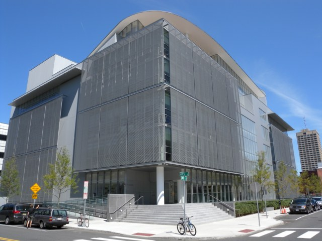

> O uso do termo laboratório em contextos sociopolíticos e culturais tem um interessante histórico, com algumas vertentes distintas e naturalmente alguns pontos controversos. São muitas as narrativas que confluem, mas uma das genealogias mais importantes gira em torno do MIT Media Lab. Vamos entender um pouco do que ele representa.

## MIT Media Lab

Um dos usos mais conhecidos da imagem do laboratório como espaço de inovação surge com a criação do <a href="http://media.mit.edu/">MIT Media Lab</a>, nos Estados Unidos. Corriam os anos oitenta, e um grupo de pesquisadores e designers conseguiu desenvolver
    um novo espaço a partir da Escola de Arquitetura do Massachusetts Institute of Technology.

Aquela universidade, mais conhecida como MIT, já era conhecida internacionalmente por ter sediado boa parte dos desenvolvimentos da cibernética como campo teórico e prático nas décadas anteriores. Certamente o MIT havia criado dezenas de laboratórios
    dentro de um contexto acadêmico-científico. Mas o MIT Media Lab buscava uma outra perspectiva, uma vez que mirava um campo novo e inexplorado - as tecnologias de informação e comunicação. Não somente se alimentava do histórico de colaboração interdisciplinar
    que havia ensejado incontáveis inovações e invenções, como também tentava abrir o próprio espaço do laboratório a públicos e metodologias os mais diversos. De fato, algumas décadas mais tarde um dos diretores do Media Lab o classificaria não como
    espaço inter ou transdisciplinar, mas antidisciplinar. Ou seja, um lugar onde pessoas vindas de todos os campos do conhecimento poderiam contribuir com o que traziam de repertório, e também poderiam avançar em campos que ainda não conheciam - ou mesmo    que não existiam.

Veja aqui um relato curto sobre tecnologias que foram criadas no Media Lab ou a partir dele (o vídeo está em inglês, mas se precisar você pode clicar para abrir em uma nova janela e assistir o video com tradução automática no youtube - veja <a href="https://www.techtudo.com.br/dicas-e-tutoriais/noticia/2013/06/como-ativar-legendas-com-traducao-automatica-no-youtube.html">aqui</a>    como fazer isso).

[embedly url="https://www.youtube.com/watch?v=F_ci1Yb6MCA"]

[fa-icon lightbulb-o] Assista a este vídeo da empreendedora brasileira <a href="https://pt.wikipedia.org/wiki/Bel_Pesce">Bel Pesce</a> contando um pouco sobre o MIT Media Lab nos dias de hoje:

[embedly url="https://www.youtube.com/watch?v=XQaCF1E6PKo"

O vídeo é interessante, mas é sempre importante prestar atenção a algumas características de linguagem e repertório. Se para o padrão do cenário industrial dos Estados Unidos o Media Lab pode ser visto como um espaço aberto a questões sociais e ambientais,
    ele não deixa de ser atravessado por questões estruturais e políticas daquele país. Mesmo quando trata de temas mais interessantes do que somente o mercado, seus projetos ainda dependem de financiamento que vem usualmente da indústria, ou tem um olhar
    enviesado por ela. Um exemplo bastante claro foi [contado por Cesar Harada[(https://web.archive.org/web/2010*/http://culturadigital.br/redelabs/2010/09/conversa-com-cesar-harada/), que passou um período no MIT e hoje coordena um makerspace em Hong Kong:

> "Nos EUA o Media Lab está quase totalmente incorporado à indústria. No laboratório onde eu trabalhava, nenhum projeto é independente. Cada projeto tem um financiador externo. Com exceção de poucas e ótimas exceções, o Media Lab do MIT é extremamente
        comercial e apoiado comercialmente. O melhor exemplo é o próprio motivo da minha saída.
> O laboratório me pediu para desenvolver uma tecnologia para limpar a mancha de óleo <em>[do <a href="https://www.pensamentoverde.com.br/meio-ambiente/o-vazamento-golfo-mexico-e-suas-consequencias/">vazamento no Golfo do México</a>]</em>. Eu projetei
        máquinas para limpar o vazamento de óleo. Mas eles queriam me forçar a trabalhar com uma nanotecnologia que só estará disponível depois de 2020. A ideia deles era pegar 20 milhões de dólares, dividir entre dois laboratórios e desenvolver o conceito
        das máquinas, em vez de soluções reais. O laboratório estava recorrendo a fundos de emergência para levantar recursos para uma tecnologia que <em>não era adequada</em> para solucionar emergências. Mas eles não se incomodam em usar dinheiro de
        pessoas que estão passando por problemas agora. Eles só querem associar arte e ciência, aparecer e ficar ricos rapidamente."

De todo modo, a visibilidade internacional do Media Lab, garantida por seus contatos com a mídia direcionada às novas tecnologias e pelo carisma de seu fundador <a href="https://pt.wikipedia.org/wiki/Nicholas_Negroponte">Nicholas Negroponte</a>, garantiu
    que a imagem de um "laboratório de mídia" como lugar essencial para criar o futuro, com espaço para questões sociais, se disseminasse pelo imaginário contemporâneo.