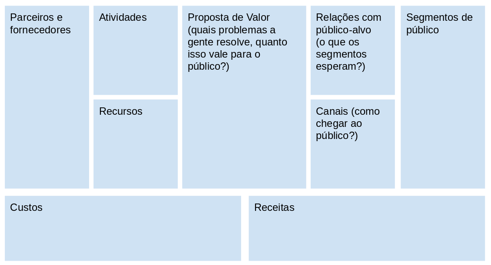

### Prototipagem

O que significa criar um protótipo? Como fazer protótipos de nossos projetos?

No site [Innovacion Ciudadana](https://www.innovacionciudadana.org/en/prototyping-creativity-and-experimentation-in-the-lab/), o protótipo é descrito como:

> The prototype will most likely start off as doodles and drawings on a paper, and will take shape throughout the creation and experimentation process established by the team.

!! Verificar quotes

"O protótipo é o primeiro modelo de algo, que mais tarde poderá ser desenvolvido, copiado, replicado ou escalado. É, por assim dizer, o primeiro original. Dentro das práticas de inovação, faz parte de uma etapa de descobrimento no processo de criação e desenvolvimento que vai possibilitar tirar as ideias do 'papel' e testar sua viabilidade e relevância.

Prototipar implica inicialmente:

- Entender as necessidades dos usuários/destinatários/afetados.
- Desenhar uma estratégia/caminho/método para alcançar essas necessidades com uma proposta inovadora.
- Estimar o esforço necessário para consegui-lo (tempo, recursos humanos/ conhecimentos, recursos materiais/técnicos/econômicos) e gerir os recursos."

### Canvas

Adaptações do Business Model Canvas - tela de modelo de negócios - para visualizar o contexto, entorno e recursos de qualquer projeto.

Canvas (em inglês, "tela" - como as telas de pintura) é uma ferramenta de planejamento que permite mapear e visualizar de forma sistêmica o projeto como um todo. O uso mais comum do canvas é em empresas de tecnologia, mas diferentes versões vêm sendo adaptadas para diversos campos de atuação.

O Canvas usualmente é preenchido das extremidades para o centro, e simplesmente passar pelo processo de encontrar as melhores respostas para cada campo costuma produzir insights valiosos. Vamos ver aqui embaixo um formato adaptado do Canvas, adaptado para projetos de qualquer natureza:

Os campos do lado direito do Canvas estão relacionados ao público. Usualmente o primeiro campo a ser preenchido é justamente a coluna do lado direito - como vimos anteriormente, a melhor forma para promover inovação é começar entendendo as pessoas que queremos impactar. Todos os outros campos serão preenchidos em função desse. Veja abaixo um exemplo de preencimento do Canvas:

https://www.youtube.com/watch?v=WUAQBV52bNU&t=1s

### Mudando por dentro

Em espanhol

### DIY Toolkit - "o cardápio"

O DIY Toolkit (em tradução livre, "caixa de ferramentas para fazer você mesmx") é um amplo resumo de métodos para desenvolver inovação orientada a pessoas. Use ele como uma espécie de cardápio de como produzir inovação relevante, inclusiva e com resultados.

Mais informações: https://diytoolkit.org/

### A viagem do herói e seus aliados-chave

Texto de Raul Oliván sobre o papel do mentor / da mentora em projetos de inovação cidadã.

https://www.innovacionciudadana.org/pt-pt/laboratorio-de-innovacion-ciudadana-el-viaje-del-heroe-y-sus-aliados-claves/

### Inspirador - dá pra fazer produção cultural de outro jeito

### O método Santalab: como potencializar a inovação pública através da criatividade cidadã

Livro produzido pela equipe de Governo Aberto da província de Santa Fé, na Argentina, “O Método Santalab: como potencializar a inovação pública a partir da criatividade cidadã” reúne os resultados alcançados em quatro anos de trabalho do laboratório cidadão SantaLab.

https://www.procomum.org/2019/12/04/lancamos-a-edicao-em-portugues-do-metodo-santalab/

Baixe o livro:

